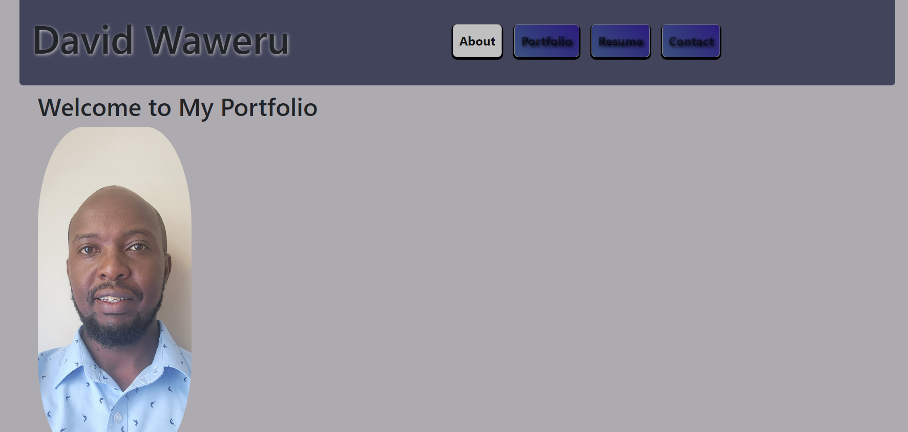

# David Waweru Webdev Portfolio 
Welcome to my portfolio website! This site showcases my work, skills, and projects. Whether you're a potential client, employer, or just curious about my work, I hope you find what you're looking for.

## Features
* Home Page: An overview of my work and what I do.
* Projects: Detailed information about the projects I've worked on.
* About Me: A brief biography and my professional background.
* Contact: Ways to get in touch with me.

## Technologies Used
* HTML/CSS: For structuring and styling the website.
* JavaScript: To add interactivity.
* React 

## Screen shots

## License
This project is licensed under the MIT License.

## Contact
If you have any questions or would like to get in touch, please contact me at dnjegah@gmail.com.
